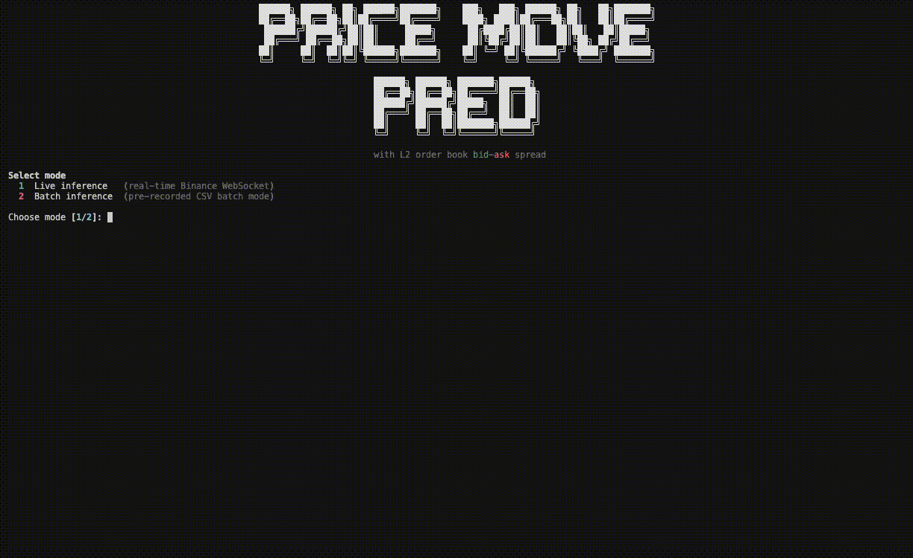

## Order Book Price Movement Predictor

Predict short-horizon BTC direction from Binance Level-2 order book data.



## End-to-End Workflow

### 1) Install

```bash
uv sync
```

### 2) Collect raw order book data

```bash
python ingest_data/collector_multi.py --symbols btcusdt --out-dir ingest_data/data
```

This writes raw L2 snapshots to `ingest_data/data/l2_data_BTCUSDT.csv`.

### 3) Transform raw data into model dataset

```bash
python transform_data/transform_dataset.py \
  --input-csv ingest_data/data/l2_data_BTCUSDT.csv \
  --output-csv transform_data/l2_data_btcusdt_transformed.csv
```

### 4) Train model artifact

```bash
python model_training/train_model.py \
  --input-csv transform_data/l2_data_btcusdt_transformed.csv \
  --artifact-dir model_training/artifacts
```

Latest artifact path:
- `model_training/artifacts/btc_direction_model.joblib`

### 5) Run app

```bash
python app.py
```

Interactive choices:
- `1` Live inference (continuous websocket scoring)
- `2` Batch inference (`csv` or `socket` source)

---

## App Modes

### Live mode

- streams Binance L2 data
- builds features (`obi`, `spread`, `depth_skew`, `momentum_10s`)
- scores each tick using current artifact
- optional hot-reload of artifact via `--model-reload-sec`

Example:

```bash
python app.py --mode live --symbol btcusdt --model-reload-sec 10
```

### Batch mode (WIP)

Two sources:
- `csv`: score existing transformed CSV
- `socket`: collect for N seconds, then score once

Socket options:
- `--batch-collect-sec`
- `--batch-cycles`
- `--batch-pause-sec`
- `--auto-train` (drift-triggered)
- `--auto-train-csv` (baseline/train dataset)

Examples:

```bash
# CSV batch
python app.py --mode batch --batch-source csv --input-csv transform_data/l2_data_btcusdt_transformed.csv

# Socket batch
python app.py --mode batch --batch-source socket --symbol btcusdt --batch-collect-sec 30

# Socket cycles + drift-triggered auto-train
python app.py --mode batch --batch-source socket --batch-cycles 5 --batch-collect-sec 20 --batch-pause-sec 2 --auto-train --auto-train-csv transform_data/l2_data_btcusdt_transformed.csv
```

---

## Drift-Triggered Auto-Train

When `--auto-train` is enabled in socket batch mode:

1. baseline stats are loaded from `--auto-train-csv`
2. each cycle computes current batch feature means
3. drift score is computed:
   - `mean(abs((current_mean - baseline_mean) / baseline_std))`
4. if score >= threshold (`0.8`), app runs `model_training/train_model.py`

This is feature-distribution drift detection, not label-performance drift.

---

## What Is One Socket Batch Cycle?

One cycle does:
1. load current artifact
2. collect websocket data for `max(batch_collect_sec, 1.0)` seconds
3. score collected rows
4. optional auto-train if drift threshold is crossed
5. sleep `batch_pause_sec` before next cycle (except final cycle)

Approx cycle time:
- no retrain: `collect_sec + scoring_overhead + pause_sec`
- with retrain: `collect_sec + scoring_overhead + train_time + pause_sec`

---

## Key Files

- `app.py` - app entrypoint
- `tui_app/cli.py` - args and interactive prompts
- `tui_app/modes.py` - live/batch runtime and drift-triggered retrain
- `tui_app/features.py` - feature construction
- `model_training/train_model.py` - training and artifact writing
- `transform_data/transform_dataset.py` - raw -> transformed dataset
- `ingest_data/collector_multi.py` - multi-symbol raw data collector